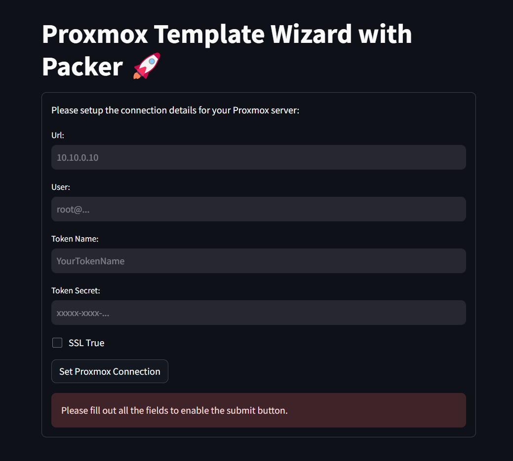
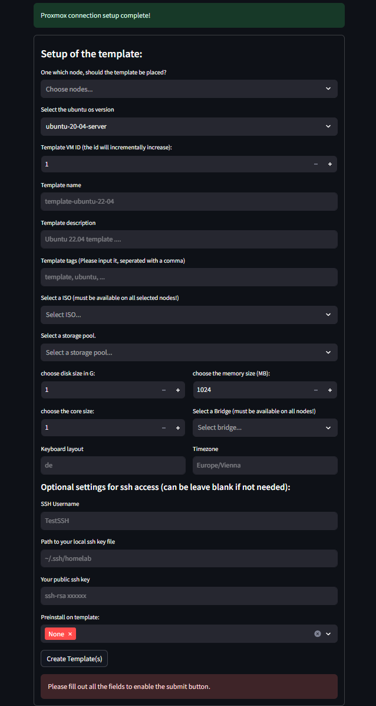

# Proxmox Template Wizard with Packer 🚀

Transform your Proxmox cluster with my sleek GUI! Craft Packer templates across all nodes with ease and 
direct the magic with a simple user interface, to click your desired config together. Quick, efficient, and totally cool - your Proxmox setup just got an 
awesome upgrade!


## The available Versions:
- Ubuntu Server 20.04
- Ubuntu Server 22.04
- Ubuntu Server 24.04

you also can include some packages like docker and docker-compose. So you then have a 
template to easily clone from, which directly have docker installed.

## Usage
Each version can be used identically, but there are some requirements for it:

- packer need to be installed on your machine where you want to run the package
- you need a proxmox api-token
- the ubuntu image need to be available in the local proxmox storage (on each node, for multiple node setup)

the command to install:
```
pip install proxmoxtemplates
```

the command to run the app:
```
proxmoxtemplates_app
```

Now you can view the app your browser.
Default under `http://localhost:8501`

### Overview

- establish a proxmox connection with filling the first form

- now fill out your needs in the second form
- 

If you wanna include other ones, feel free to clone or fork.
Have fun with the templates 🚀🎉

